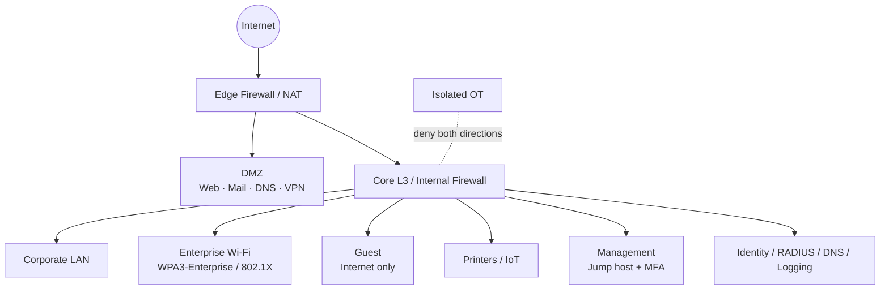

# Enterprise Network Security Architecture

[简体中文](README.zh-CN.md)

A fictional enterprise network-security design expressed as **architecture-as-code**: CIDR-safe VLAN planning, a default-deny firewall policy, segmentation, DMZ design, remote access, enterprise Wi-Fi, an explicit OT trust boundary, automated validation, and threat-model documentation.

> This is a **post-course portfolio reimplementation**, not an original assessment submission. The organisation, topology, addresses and policy in this repository are fictional and do not describe Monash University or any real production network.

## Why this refactor exists

A network diagram is easy to draw but also easy to make internally inconsistent. This version turns the important design decisions into machine-readable JSON and validates them with Python.

The validator checks, among other things:

- CIDR boundaries are valid;
- every internal segment stays inside the declared `10.20.0.0/21` supernet;
- segments do not overlap;
- gateways are usable addresses;
- VLAN IDs are unique;
- the firewall is default-deny;
- policy references known zones;
- guest isolation and OT isolation rules are explicitly present.

## Architecture



See [docs/architecture.md](docs/architecture.md), [docs/threat-model.md](docs/threat-model.md), and [docs/security-controls.md](docs/security-controls.md).

## Address plan

| Zone | Subnet | Usable hosts | Intent |
|---|---|---:|---|
| Corporate LAN | `10.20.0.0/23` | 510 | Managed endpoints |
| Corporate Wi-Fi | `10.20.2.0/23` | 510 | 802.1X clients |
| Guest | `10.20.4.0/24` | 254 | Internet only |
| IoT / Print | `10.20.5.0/25` | 126 | Printers and constrained devices |
| Management | `10.20.5.128/26` | 62 | Jump host / admin plane |
| DMZ | `10.20.5.192/26` | 62 | Public services |
| Infrastructure | `10.20.6.0/25` | 126 | Identity, RADIUS, DNS, logging |
| VPN pool | `10.20.6.128/25` | 126 | Remote clients |

An example OT environment lives in a separate `10.30.0.0/24` security domain and is explicitly denied bidirectional corporate access in the sample policy.

## Run validation

No third-party packages are required.

```bash
PYTHONPATH=. python scripts/validate_architecture.py
python -m unittest discover -s tests -v
```

## Repository structure

```text
enterprise-network-security-architecture/
├── config/
│   ├── network_plan.json
│   └── firewall_policy.json
├── src/
│   └── validator.py
├── scripts/
│   └── validate_architecture.py
├── docs/
│   ├── architecture.md
│   ├── threat-model.md
│   └── security-controls.md
├── tests/
│   └── test_validator.py
└── .github/workflows/tests.yml
```

## Security decisions demonstrated

- default-deny firewalling and least privilege;
- DMZ isolation for internet-facing services;
- VLAN segmentation and inter-zone ACLs;
- WPA3-Enterprise / 802.1X / RADIUS;
- MFA-protected remote and privileged access;
- dedicated management plane;
- guest and IoT containment;
- explicit IT/OT trust boundary;
- central logging, EDR, encryption and recovery controls;
- architecture validation in CI.

## Origin

The project was rebuilt after studying enterprise network-security concepts in **FIT1047 Introduction to Computer Systems, Networks and Security** at Monash University. The original coursework used a different scenario and addressing scheme; no assessment specification, submission, or real infrastructure data is included here.
