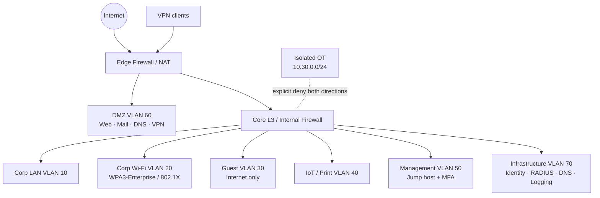

# Architecture

```mermaid
flowchart TB
  Internet((Internet)) --> FW[Edge Firewall / NAT]
  FW --> DMZ[DMZ VLAN 60\nWeb · Mail · DNS · VPN]
  FW --> Core[Core L3 / Internal Firewall]
  Core --> LAN[Corp LAN VLAN 10]
  Core --> WIFI[Corp Wi-Fi VLAN 20\nWPA3-Enterprise / 802.1X]
  Core --> GUEST[Guest VLAN 30\nInternet only]
  Core --> IOT[IoT / Print VLAN 40]
  Core --> MGMT[Management VLAN 50\nJump host + MFA]
  Core --> INFRA[Infrastructure VLAN 70\nIdentity · RADIUS · DNS · Logging]
  VPN[VPN clients] --> FW
  OT[Isolated OT\n10.30.0.0/24] -.-|explicit deny both directions| Core
```

The diagram is intentionally generic. All names, addresses and business details in this repository are fictional.
